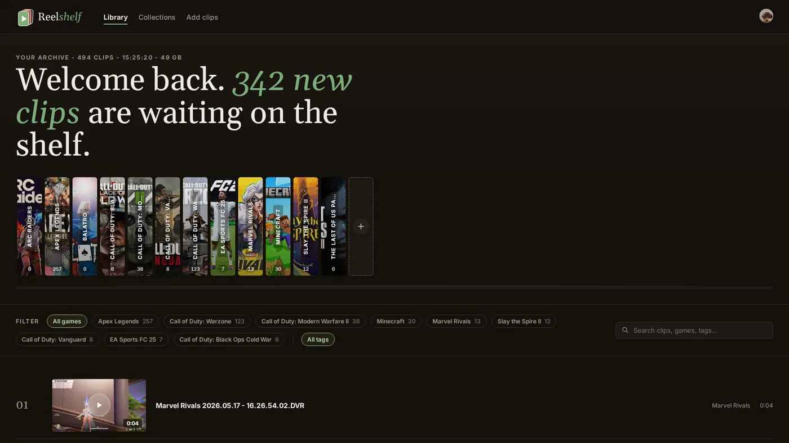
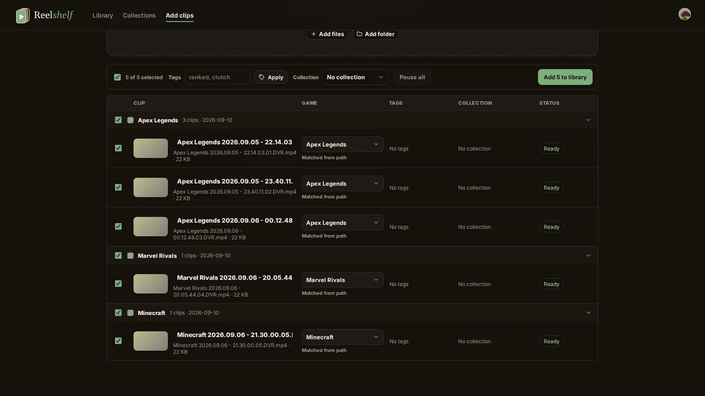
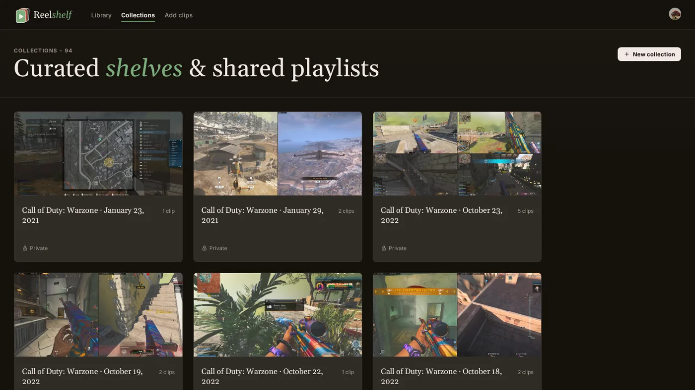

<p align="center">
  
</p>

<h1 align="center">Reelshelf</h1>

<p align="center"><strong>Every clip, on one shelf.</strong></p>

<p align="center">
  A personal library for your gameplay clips. Drop in a whole night of recordings and they land filed by game and by session, ready to share with the people who were there.
</p>

<p align="center">
  <a href="https://reelshelf.app"><strong>reelshelf.app</strong></a> · free, with 25 GB of clip storage · sign in with Discord or Twitch
</p>

---

## Why Reelshelf

Recording software leaves you with a folder of `Apex Legends 2026.03.26 - 21.33.05.07.DVR.mp4`. The good moments are in there somewhere, next to hundreds of near-misses, and the only way to find them is to scrub through everything. Sharing means uploading to somewhere that will compress it, expire it, or make your friends sign up.

Reelshelf is the shelf those clips should have been on all along. Every game gets its own book, every night gets its own collection, and any clip can be handed to a friend as one link.

## What's on the shelf

### Every game gets its own book

Your library is a shelf of games with real cover art, not a folder of filenames. Pick a game, filter by tag, or search, and see what's new since you last looked.

### Upload a whole night at once

Drag your recorder's folder onto the library. Reelshelf reads the game from each filename, groups the clips into the session they came from, and lets you fix guesses, add tags, and pick a collection before anything uploads. Three clips upload at a time, resumable, with pause and resume per clip or for the whole queue.

<p align="center">
  
</p>

### Sessions file themselves

Clips from the same game on the same night land in one collection without you lifting a finger. Rename it, tidy it, or leave it as the record of that evening. Upload more from the same night later and they join the same collection.

### Collections you build with friends

Put the best moments in the order you want them watched, then invite the people who were there. They can watch everything in it and add their own clips alongside yours.

<p align="center">
  
</p>

### Share one clip with one link

Send a link and it plays. No account needed on their end, and the clip is only visible to people who have the link.

### Bring your Twitch clips with you

Linked a Twitch account? Pick clips straight from your channel and Reelshelf copies them into the library for you. They are filed into the same sessions a local upload from that night would be.

### Nothing gets stuck here

Download any clip back to your computer whenever you like. Reelshelf is somewhere to keep them, not somewhere they get stuck.

## Getting started

1. Go to [reelshelf.app](https://reelshelf.app) and sign in with Discord or Twitch. There's no form to fill in and nothing to pay. Link the other one later and either login opens the same shelf.
2. Drag your recorder's folder onto the library. Review the queue, fix any game guesses, pick tags, and let it upload.
3. Sessions are already grouped. Build collections with friends, send one clip with one link, or download it back.

Everyone gets 25 GB of clip storage on the free tier.

---

## Under the hood

Reelshelf is a single repository: a .NET 10 API that serves a React 19 frontend, backed by PostgreSQL and Bunny Stream.

| Part          | Stack                                                                                                                                                                     |
| ------------- | ------------------------------------------------------------------------------------------------------------------------------------------------------------------------- |
| `frontend/`   | React 19, TypeScript, Vite, TanStack Router and Query, tus-js-client for resumable uploads                                                                                |
| `api/`        | .NET 10 minimal API, Dapper on PostgreSQL, Redis, Bunny Stream for storage, encoding, and playback, FFmpeg for downloads, IGDB for game metadata, Resend for account mail |
| `migrations/` | Explicit Evolve migration runner; the API never migrates on startup                                                                                                       |
| `Dockerfile`  | Builds the frontend, publishes the API, and serves the frontend from the API's `wwwroot`                                                                                  |

The frontend talks to the API through a TypeScript client generated from the API's OpenAPI document and committed under `frontend/src/api-client/`; CI fails if it drifts.

```sh
bun install
bun run dev                  # frontend
dotnet run --project api     # API
bun run check                # build, typecheck, lint, test, format
bun run generate:api-client  # after API contract changes
DatabaseConnectionString="Host=...;Database=...;Username=...;Password=..." bun run migrate
```

The interesting decisions are written up as ADRs in [`docs/adr/`](docs/adr/): gaming sessions as auto-generated playlists, open sign-up with storage tiers, linked identities across sign-in providers, and server-side Twitch clip import. Repository conventions, commands, and deployment notes live in [`AGENTS.md`](AGENTS.md); the domain vocabulary is in [`CONTEXT.md`](CONTEXT.md).
